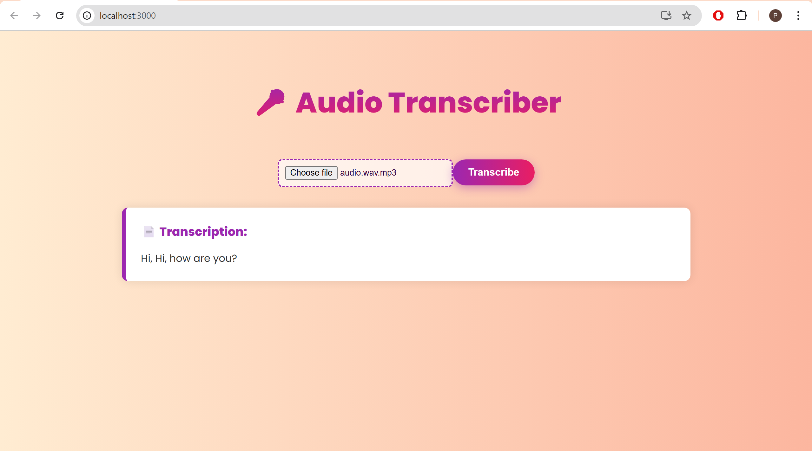

# Audio Transcriber Web App

A full-stack web application that transcribes audio to text using AssemblyAI’s speech recognition API. Users can upload an audio file and receive an accurate transcription in seconds.

---

##  Demo Video

[Watch Demo Video](https://youtu.be/xspcfijeCsA)  


---

##  Problem Statement

Manual transcription of audio is time-consuming, prone to errors, and inefficient. Professionals, students, and researchers often need fast, reliable transcription tools that work across platforms.

---

##  Solution Approach

This project uses:
- A **React.js** frontend to create an intuitive interface for uploading audio files.
- A **Spring Boot** backend to handle file processing and communication with the **AssemblyAI** transcription service.
- **AssemblyAI's REST API** to convert speech to text with high accuracy.

---

## Tech Stack Used

| Layer           | Technology              |
|----------------|--------------------------|
| Frontend       | React.js, Axios          |
| Styling        | Inline CSS (React-based) |
| Backend        | Spring Boot              |
| API Integration| REST APIs (AssemblyAI)   |

---

##  Features

- Upload audio files (`.mp3`, `.wav`, etc.) directly from browser.
- Automatic transcription using AssemblyAI.
- Displays the transcribed text clearly in the UI.
- Real-time loading indicator while processing.
- Graceful error handling and user-friendly feedback.

---

##  Future Improvements

- Add microphone-based live recording and transcription.
- Support subtitle (SRT/VTT) file download.
- Enhance UI with TailwindCSS or Material-UI.
- Display transcription confidence scores and timestamps.

---

##  Output Screenshots

### 1. Upload Screen  


### 2. Transcription Result  



---

##  How to Run Locally

###  Backend (Spring Boot)
1. Clone the project.
2. Navigate to backend folder:
   ```bash
   cd backend

3. Open `application.properties` and paste your AssemblyAI API Key
4. Run the Spring Boot app
   ```bash
   ./mvnw spring-boot:run
6. Open another terminal
7. Navigate to frontend folder
   ```bash
   cd backend
8. Install dependencies
   ```bash
   npm install
9. Start the frontend
   ```bash
   npm start
10. The app should now run at: (http://localhost:3000)


